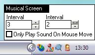



## \[ Musical Screen \]

### Description

simply turns screen into some kind of musical instrument, plays different sound depending on where cursor is , tone length and cursor movement detection interval can be modified

(screen shot kind of pointless but never mind)
 
### More Info
 

             |
---                |---
**Submitted On**   |2004-07-24 08:44:12
**By**             |[Gareth CodeMan](https://github.com/Planet-Source-Code/PSCIndex/blob/master/ByAuthor/gareth-codeman.md)
**Level**          |Intermediate
**User Rating**    |4.7 (14 globes from 3 users)
**Compatibility**  |VB 6\.0
**Category**       |[Miscellaneous](https://github.com/Planet-Source-Code/PSCIndex/blob/master/ByCategory/miscellaneous__1-1.md)
**World**          |[Visual Basic](https://github.com/Planet-Source-Code/PSCIndex/blob/master/ByWorld/visual-basic.md)
**Archive File**   |[\[\_Musical\_1773677242004\.zip](https://github.com/Planet-Source-Code/gareth-codeman-musical-screen__1-55154/archive/master.zip)

